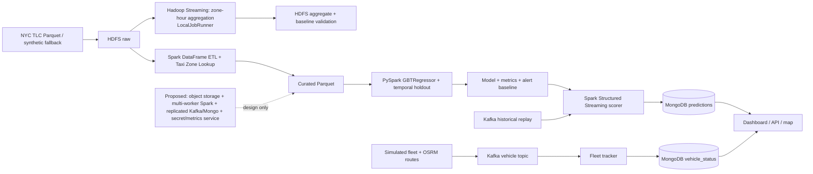

# Taxi Hotspot Batch + Streaming

Đây là prototype batch + streaming cho phân tích điểm nóng taxi và điều phối đội xe mô phỏng. Batch tạo dữ liệu curated và model artifact; streaming replay sự kiện, chấm hotspot bằng model và ghi kết quả vào MongoDB. Đánh giá model hiện đo khả năng dự đoán relative hotspot score trên các ngày chưa thấy, không phải số chuyến taxi tuyệt đối hay nhu cầu live. Phạm vi không xử lý giá cước/doanh thu.

## Chạy toàn bộ

```bash
docker compose up --build
```

Sau khi stack khởi động:

- Spark UI: http://localhost:8080
- HDFS NameNode UI: http://localhost:9870
- Dashboard/API: http://localhost:8088
- Dashboard health: http://localhost:8088/health

Nếu cổng Spark UI `8080` đã được ứng dụng khác sử dụng, chọn cổng host khác trước khi chạy stack (ví dụ PowerShell):

```powershell
$env:SPARK_UI_PORT="18080"
docker compose up --build
```

Khi đó Spark UI ở `http://localhost:18080`; cổng bên trong container vẫn giữ nguyên.

Các stage one-shot báo `[PASS]` khi hoàn tất. `mapreduce-job` chuẩn bị TSV từ TLC Parquet và tạo baseline Counter độc lập; `hadoop-streaming` chạy mapper, combiner, shuffle và reducer trên HDFS rồi đối chiếu toàn bộ kết quả với baseline. Hadoop dùng LocalJobRunner trong Docker, chưa phải triển khai YARN đa node. `spark-etl` nối Taxi Zone Lookup vào curated Parquet. Chạy hai truy vấn Spark SQL và phép thử partition bằng `docker compose --profile analysis run --rm spark-analysis`. `streaming-predictor`, `kafka-producer` và `dashboard` tiếp tục chạy; producer lặp dataset để mô phỏng realtime cho đến khi dừng bằng `docker compose stop kafka-producer`.

## Kiến trúc end-to-end



Các thành phần Docker Compose và các đường liền là phần chạy local đã có evidence. Đường chấm là thiết kế mở rộng, chưa triển khai. Hadoop Streaming dùng LocalJobRunner một máy; weather là candidate không được chọn cho model hiện tại.

## Artifact và chạy lại

- Model: `models/hotspot_model/`
- Chỉ số đánh giá model holdout (RMSE/MAE): `output/evidence/model_metrics.json`
- Checkpoint realtime: `checkpoints/taxi-hotspot-realtime-v4/`
- Dữ liệu local: `data/raw`, `data/curated`, `data/results`
- HDFS: `/taxi/raw` và `/taxi/curated/trips`
- MongoDB collection: `taxi.hotspot_predictions`
- Kafka topic realtime: `taxi_trips_realtime_v2`

Những lần `docker compose up` sau sẽ bỏ qua train nếu model artifact đã tồn tại. Chủ động train lại:

```bash
docker compose run --rm -e FORCE_TRAIN=true model-trainer
```

Stage train lấy dữ liệu curated từ HDFS, nhóm theo ngày, zone, giờ và thứ, rồi tạo nhãn hotspot score tương đối 0–100. Các chuyến trước 2022 bị loại khỏi train vì Open-Meteo Historical Forecast bắt đầu từ giai đoạn 2021/2022. Hai ứng viên GBTRegressor (zone/giờ/thứ và cùng bộ đặc trưng cộng weather) được so sánh trên cùng temporal holdout: 80% ngày đầu train, 20% ngày cuối test. Model weather chỉ được deploy khi RMSE giảm và MAE không xấu hơn quá 2%; nếu không, deploy ứng viên calendar-only. Ngưỡng bất thường được tính từ score của tập train theo zone/giờ/thứ: mean + 3 độ lệch chuẩn, yêu cầu ít nhất 5 mẫu. MAE, RMSE, R², Precision/Recall, TP/FP/FN, so sánh ứng viên và cách chia tập được lưu tại `output/evidence/model_metrics.json`; baseline cảnh báo ở `models/historical_baseline.json`.

Lần train mới ngày 04/10/2026 có 639.393 dòng train trên 175 ngày (2024-12-31–2026-06-21) và 128.644 dòng test trên 44 ngày kế tiếp (2026-06-22–2026-08-05). Calendar baseline đạt MAE 7,366, RMSE 11,044 và R² 0,658 điểm; ở score ≥ 50, Precision 88,39%, Recall 30,88% (TP=2.314, FP=304, FN=5.180). Weather candidate đạt MAE 7,366, RMSE 11,047, R² 0,657; không được chọn vì RMSE không giảm. API lịch sử phủ 100% (768.037 dòng đủ điều kiện). Vì vậy model đang deploy dùng zone/giờ/thứ; weather vẫn được hiển thị và lưu làm bối cảnh, chưa làm thay đổi score. Đây là metric của score tương đối, không phải số chuyến; Recall thấp nên còn bỏ sót nhiều trường hợp nóng. Chi tiết và quy tắc chọn model ở `output/evidence/model_metrics.json`.

**Hướng cải thiện cần đánh giá tiếp:** Recall 30,88% cho thấy ngưỡng score ≥ 50 bắt ít hơn một phần ba hotspot thực tế trên holdout; không nên gọi đây là “độ chính xác 65,8%” vì R² không phải accuracy. So sánh tiếp theo nên thêm lag demand theo zone (ví dụ 1 giờ và 24 giờ trước), lịch ngày lễ/sự kiện NYC, rồi weather theo vùng nếu có dữ liệu phù hợp. Tạo các đặc trưng chỉ từ thời điểm dự báo trở về trước, dùng cùng temporal holdout hoặc rolling-origin backtest, và báo MAE/RMSE/R² cùng Precision/Recall hoặc Recall@top-k tại cùng ngân sách điều phối. Chỉ thay model đang deploy nếu kết quả ngoài mẫu cải thiện và các đặc trưng mới có thể tạo đồng nhất ở batch lẫn serving.

Batch cũng bỏ qua MapReduce/ETL nếu artifact đã có. Khi thay bộ Parquet nguồn, chạy lại có chủ đích:

```bash
docker compose run --rm -e FORCE_BATCH=true mapreduce-job
docker compose run --rm --no-deps -e FORCE_BATCH=true hadoop-streaming
docker compose run --rm -e FORCE_ETL=true spark-etl
docker compose run --rm -e FORCE_TRAIN=true model-trainer
```

Nếu muốn reset toàn bộ dữ liệu demo, dừng stack rồi xóa các thư mục `models/`, `checkpoints/`, `data/results/` và dùng `docker compose down -v` để xóa named volumes HDFS/Kafka/MongoDB. Đây là thao tác destructive.

## Lưu ý phạm vi và nguồn dữ liệu

- **Batch và model:** mặc định đọc 7 file NYC TLC Yellow Taxi Parquet đã có trong workspace tại `Nyc taxi trip record/Nyc taxi trip record/` (mẫu `yellow_tripdata_*.parquet`). Đây là dữ liệu chuyến taxi Yellow Taxi do NYC Taxi & Limousine Commission công bố; các cột chính pipeline dùng là `tpep_pickup_datetime`, `PULocationID`, `DOLocationID`. Script `scripts/run_mapreduce.sh` tạo đầu vào TSV zone/giờ trên HDFS và Counter baseline độc lập. `hadoop-streaming` chạy Bash/awk mapper, combiner và reducer qua Hadoop Streaming, dùng shuffle của Hadoop; kết quả được so sánh đầy đủ với baseline. Job đã xử lý 26.116.976 chuyến thành 6.155 nhóm zone/giờ. Runner là LocalJobRunner một node, không phải YARN cluster. Spark ETL broadcast left join lookup 265 dòng cho pickup/dropoff; sau join vẫn 26.116.976 dòng, không có ID unmatched.
- **Lấy bản gốc:** tải Yellow Taxi Trip Records từ [NYC TLC Trip Record Data](https://www.nyc.gov/site/tlc/about/tlc-trip-record-data.page) hoặc [NYC TLC trên AWS Open Data](https://registry.opendata.aws/nyc-tlc-trip-records/), rồi đặt các Parquet `yellow_tripdata_*.parquet` vào thư mục trên. Project không tự tải toàn bộ dataset khi khởi động. Muốn dùng bộ khác, đặt file ở đó và chạy lại batch, ETL, rồi train bằng các lệnh `FORCE_BATCH`, `FORCE_ETL`, `FORCE_TRAIN` bên trên.
- **Fallback:** nếu không có Parquet TLC trong thư mục, batch tạo `data/raw/taxi_trips.csv` với dữ liệu deterministic tổng hợp (mặc định 10.000 dòng). Dữ liệu fallback mô phỏng schema TLC, không phải chuyến đi thật. Có thể đặt CSV của bạn tại `data/raw/taxi_trips.csv`; generator giữ nguyên file đã tồn tại. Nguồn CSV fallback này cũng được dùng cho realtime replay.
- **Realtime replay:** producer phát tối đa `SIMULATION_SOURCE_ROWS` dòng từ cùng bộ Parquet TLC; nếu không có thì đọc CSV fallback trong `data/raw/taxi_trips.csv`. Timestamp lịch sử được thay bằng simulation clock hiện tại theo America/New_York, vì vậy đây là phát lại tăng tốc, không phải live feed.
- **Thời tiết:** batch so sánh calendar-only với weather candidate bằng hourly weather từ Open-Meteo tại một tọa độ đại diện trung tâm NYC (40.7128, −74.0060), theo America/New_York. Train dùng Historical Forecast API để gần với dữ liệu forecast có thể có tại thời điểm dự báo; dashboard/serving dùng Forecast API. Lần holdout hiện tại không chọn weather candidate, nên thời tiết được hiển thị và lưu làm bối cảnh, chưa làm đổi score. Đây là proxy chung cho toàn thành phố, không phải quan trắc theo taxi zone. Giờ thiếu weather dùng median train và được gắn cờ. API miễn phí chỉ dùng phi thương mại; điều khoản yêu cầu ghi công theo CC BY 4.0 và áp giới hạn lượt gọi. Chỉ dùng cho demo học thuật; nếu triển khai thương mại cần kiểm tra gói/điều khoản tương ứng tại [Open-Meteo Terms](https://open-meteo.com/en/terms).
- **Ranh giới bản đồ:** `dashboard/static/taxi_zones.geojson` chứa 263 polygon parts ứng với 260 LocationID duy nhất (một số zone có nhiều phần rời), cùng tên zone và borough. Ranh giới là dữ liệu địa lý NYC TLC được phân phối ở dạng GeoJSON; tham chiếu bộ gốc tại [NYC Taxi Zones](https://catalog.data.gov/dataset/nyc-taxi-zones) và bản chuyển đổi được dùng để đóng gói tại [nyc-taxi-map](https://github.com/chkp-fernandom/nyc-taxi-map/blob/master/data/zones.geojson). Bản đồ chỉ tô vùng theo LocationID; không suy ra ranh giới chính xác hơn dữ liệu nguồn.
- **Vị trí và trạng thái xe:** 40 xe, tốc độ và trạng thái do simulator tạo ra; chúng không đến từ GPS hoặc dữ liệu định vị NYC TLC. Đường đi được lấy từ OSRM trên dữ liệu đường OpenStreetMap, xe di chuyển dọc hình học tuyến lái xe. Dịch vụ định tuyến cần kết nối Internet; nếu không lấy được tuyến, xe đứng yên và thử lại, không tự đi đường thẳng. Có thể đổi endpoint bằng `ROUTING_BASE_URL`, thời gian thử lại bằng `ROUTE_RETRY_SECONDS` và giới hạn nhịp gọi bằng `ROUTE_REQUEST_INTERVAL_SECONDS`.

Tham khảo cấu trúc cột tại [Yellow Taxi Data Dictionary](https://www.nyc.gov/assets/tlc/downloads/pdf/data_dictionary_trip_records_yellow.pdf) và zone tại [Taxi Zone Lookup CSV](https://d37ci6vzury5cl.cloudfront.net/misc/taxi_zone_lookup.csv).

## Ảnh chụp và evidence

- Dashboard với weather forecast, polygon Taxi Zone và metric lần train mới: [`output/playwright/weather-model-dashboard-2026-10-04.png`](output/playwright/weather-model-dashboard-2026-10-04.png).
- Bản đồ score theo giờ, xe mô phỏng và polygon Taxi Zone: [`output/playwright/weather-model-map-2026-10-04.png`](output/playwright/weather-model-map-2026-10-04.png).
- Ảnh mobile 375 px: [`output/playwright/weather-model-mobile-2026-10-04.png`](output/playwright/weather-model-mobile-2026-10-04.png); không có tràn ngang khi rà bằng trình duyệt.
- Ảnh chụp kiểm tra live ở 375/768/1440 px: [`browser-qa-375.png`](output/playwright/browser-qa-375.png), [`browser-qa-768.png`](output/playwright/browser-qa-768.png), [`browser-qa-1440.png`](output/playwright/browser-qa-1440.png); nav đã tự xuống hàng ở tablet/mobile và không tràn ngang. Kết quả API, điều hướng và filter: [`output/evidence/browser_qa_summary_2026-10-04.json`](output/evidence/browser_qa_summary_2026-10-04.json).
- Ảnh console/runtime: [`output/playwright/console-log-evidence-2026-10-04.png`](output/playwright/console-log-evidence-2026-10-04.png). Snapshot API/fleet có trong [`output/evidence/runtime_capture_2026-10-04.json`](output/evidence/runtime_capture_2026-10-04.json) và [`output/evidence/fleet_movement_capture_2026-10-04.json`](output/evidence/fleet_movement_capture_2026-10-04.json).
- Báo cáo đã mở và phân trang trong Microsoft Word: [`output/documents/BDA501_Final_Project_Report_Submission.docx`](output/documents/BDA501_Final_Project_Report_Submission.docx); 16 trang nội dung, tài liệu tham khảo bắt đầu ở trang 17. Kết quả kiểm tra: [`output/evidence/docx_render_check.json`](output/evidence/docx_render_check.json). Trước khi nộp, điền thông tin nhóm/thành viên, tỷ lệ đóng góp và CLO chính thức.
- Nội dung cần đồng bộ với deck Canva Session 10 được rà soát trong [`output/documents/Session10_Presentation_Corrections.md`](output/documents/Session10_Presentation_Corrections.md); đây là checklist chỉnh sửa, không phải bản Canva đã cập nhật.
- Kết quả train và so sánh calendar/weather: [`output/evidence/model_metrics.json`](output/evidence/model_metrics.json). Model GBTRegressor được đánh giá bằng temporal holdout.
- Hadoop Streaming log, HDFS output và so sánh với baseline độc lập: [`output/evidence/hadoop_streaming.log`](output/evidence/hadoop_streaming.log), [`output/evidence/mapreduce_actual.csv`](output/evidence/mapreduce_actual.csv), [`output/evidence/mapreduce_expected.csv`](output/evidence/mapreduce_expected.csv). Job local đã xử lý 26.116.976 input records thành 6.155 nhóm; đây không phải benchmark YARN đa node.
- Kết quả hai truy vấn Spark SQL và formatted plans: [`output/evidence/spark_query_results.json`](output/evidence/spark_query_results.json), [`output/evidence/spark_query_plans.txt`](output/evidence/spark_query_plans.txt); truy vấn top zone trả 20 dòng, profile borough/hour trả 192 dòng.
- Benchmark shuffle partition: [`output/evidence/performance_benchmark.json`](output/evidence/performance_benchmark.json). Trên sample cache 100.000 dòng, 13.725 nhóm đầu ra trùng khớp; median 4 partitions là 0,272 giây và 16 partitions là 0,238 giây. Đây là phép đo cục bộ một máy, không chứng minh hiệu năng cluster.
- Data profile và snapshot HDFS, Kafka, MongoDB, fleet/dashboard được lưu trong [`output/evidence/`](output/evidence/). SHA-256 cho các snapshot, ảnh giao diện và báo cáo được liệt kê tại [`output/evidence/artifact_checksums.json`](output/evidence/artifact_checksums.json).
- Dữ liệu hotspot hiển thị trên bản đồ: [`output/playwright/dispatch-hotspots.json`](output/playwright/dispatch-hotspots.json), gồm điểm trung bình và số bản ghi suy luận theo zone.
- Data profile ghi nhận 26.116.976 dòng raw/curated; log Spark ETL xác nhận lookup 265 zone, row count trước/sau join không đổi và 0 pickup/dropoff ID unmatched. Model dùng 768.037 dòng tổng hợp zone/ngày/giờ có weather coverage từ 2024-12-31. Các chuyến trước 2022 không được đưa vào train. Log: [`output/evidence/spark_etl_enrichment.log`](output/evidence/spark_etl_enrichment.log).
- Dependency audit của các package cài qua `requirements.txt`: [`output/evidence/dependency_audit.json`](output/evidence/dependency_audit.json); lần kiểm tra 04/10/2026 không phát hiện lỗ hổng đã biết.
- Để thu lại bằng chứng từ stack đang chạy, dùng `scripts/collect_evidence.ps1`, sau đó chạy `python scripts/package_evidence.py` để đóng gói các snapshot đã chọn và tạo lại manifest SHA-256.

Feature engineering mặc định được thực hiện trong `spark/train_model.py`; các stage và lệnh chạy lại được liệt kê ở trên.

## Realtime simulation theo schema NYC TLC

Batch ưu tiên dùng các file NYC TLC Parquet đặt tại `Nyc taxi trip record/Nyc taxi trip record`: bước chuẩn bị tạo TSV pickup-zone/hour và Counter baseline độc lập; HDFS lưu raw Parquet cùng TSV; Hadoop Streaming thực thi mapper/combiner/reducer bằng LocalJobRunner; Spark ETL đọc Parquet, nối zone lookup và tạo curated dataset. Nếu thư mục không có, pipeline tự fallback về CSV mô phỏng deterministic. Producer lấy tối đa `SIMULATION_SOURCE_ROWS` bản ghi từ cùng nguồn Parquet để phát sự kiện realtime; ngoài hotspot event, producer còn phát snapshot 40 xe vào topic `taxi_vehicles`, `fleet-tracker` đọc topic này và lưu trạng thái hiện tại vào collection `taxi.vehicle_status` để dashboard hiển thị bản đồ và danh sách xe.

Dashboard tiếng Việt tại `http://localhost:8088/` có filter pickup zone, bản đồ OpenStreetMap với polygon taxi zone thật, màu score dự báo theo giờ có thể chọn, marker xe mô phỏng, ranking replay, gợi ý điều phối minh họa, thời tiết hiện tại và forecast hotspot 3 giờ kế tiếp. Marker được nội suy giữa các snapshot Kafka; producer chạy lặp liên tục và dừng bằng `docker compose stop kafka-producer`.

**Vì sao một zone nóng:** batch đếm chuyến đón theo zone, ngày, giờ và thứ trong tuần. Score = (số chuyến zone ÷ số chuyến cao nhất giữa các zone trong cùng ngày/giờ/thứ) × 100. GBTRegressor dự báo score tương đối từ zone, giờ, thứ; không dùng KMeans. Calendar model được chọn vì weather candidate không cải thiện temporal holdout. Streaming chấm sự kiện replay; map forecast chấm từng LocationID cho giờ tương lai. Điểm hotspot không phải số chuyến thực tế hay nhu cầu live.

Producer dùng simulation clock theo America/New_York, phát event tăng tốc theo `SIMULATION_EVENT_TIME_STEP_SECONDS`. Snapshot đội xe phát định kỳ; xe có tọa độ đích, hướng, tốc độ, tiến độ và ETA. Tuyến gọi OSRM Route API với hồ sơ `driving`; tọa độ điểm đi/đến được OSRM snap vào mạng đường gần nhất. Đây là mô phỏng realtime tăng tốc, không phải GPS xe thật. Polygon bản đồ dựa trên bộ ranh giới NYC TLC Taxi Zone; màu theo score forecast của từng LocationID cho giờ được chọn.

Điều chỉnh tốc độ hoặc số event:

```bash
$env:PRODUCER_DELAY_SECONDS="0.10"
$env:SIMULATION_MAX_EVENTS="1000"
docker compose up --build
```

Để lấy một sample chính thức và bảng zone lookup cho simulator:

```bash
docker compose run --rm --no-deps --entrypoint python3 kafka-topic-init /workspace/scripts/fetch_tlc_sample.py
```

Lệnh trên lưu sample vào `data/reference/`. Simulator vẫn là dữ liệu deterministic để demo ổn định, nhưng dùng đúng tên cột và taxi-zone vocabulary của TLC; nếu file zone lookup tồn tại, các zone được lấy từ file đó.

Nguồn dữ liệu được dùng làm chuẩn:

- NYC TLC Trip Record Data: https://www.nyc.gov/site/tlc/about/tlc-trip-record-data.page
- Yellow Taxi Data Dictionary: https://www.nyc.gov/assets/tlc/downloads/pdf/data_dictionary_trip_records_yellow.pdf
- Taxi Zone Lookup CSV: https://d37ci6vzurychx.cloudfront.net/misc/taxi_zone_lookup.csv
- NYC TLC dataset trên AWS Open Data: https://registry.opendata.aws/nyc-tlc-trip-records-pds/

`spark/clean.py` hỗ trợ schema TLC (`tpep_pickup_datetime`, `PULocationID`, `DOLocationID`) và schema CSV chuẩn hóa cũ. Bộ zone lookup chính thức được lưu tại `data/reference/taxi_zone_lookup.csv`; Spark ETL đã nối tên zone, borough và service zone vào các trường pickup/dropoff của curated dataset.
